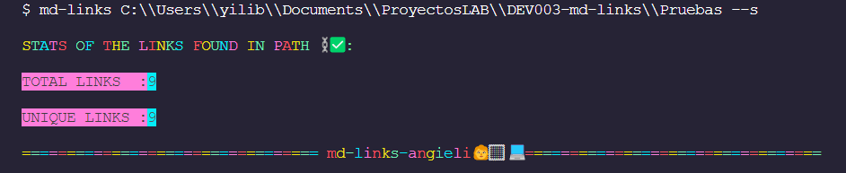

# Markdown Links

## Content

* [1. Preamble](#1-preamble)
* [2. About md-links-angieli](#2-about-md-links-angieli)
* [3. Development process](#3-development-process)
* [4. Installation](#4-Installation)
* [5. Commands](#5-Commands)
* [6. Author](#6-author)


***
## 1. Preamble

[Markdown] is a lightweight markup language
markup language very popular among developers. It is used in many platforms that
platforms that handle plain text (GitHub, forums, blogs, ...) and it is very common to find several files in this to find several files in that format in any kind of repository
(starting with the traditional `README.md`).

These `Markdown` files usually contain _links_ (links) which are often broken or no longer
are often broken or no longer valid and this greatly impairs the value of the information you want to
the information to be shared.

Within an open source community, I have been proposed to create a tool using Node.js , that reads and analyzes files in `Markdown` format, to verify the links they contain and report some statistics.

 ## 2. About md-links-angieli

Angie-li-md-links is a library that uses [Node.js] to extract the links found in a Markdown (.md) file. In turn displaying some properties of the links: The file path, URL, status, status code (with this property we will know if the link is broken), the link text, if it has been validated and report some statistics.

## 3. Development process
A flowchart was elaborated to organize the development path of this project.


## 4. Installation
You can install md-links-angieli through npm:                                   

## 5. Commands

You must access the terminal and run the command:

````md-links``` or ```md-links --help```` .

This first command will show us the directions to follow to run the program and the options that exist.

#### Example:


##### `--validate`

If we pass the `--validate` option, the module should make an HTTP request to
find out if the link works or not. If the link results in a redirect to a
URL that responds ok, then we will consider the link as ok.

#### Example:


##### `--stats`

If we pass the `--stats` option the output will be a text with statistics
Basics about links.
#### Example:


##### `--stats` `--validate` 
We can also combine `--stats` and `--validate` to get statistics that
need the validation results.
#### Example:


## 6. Autora

Angie Liliana Cómbita Martínez

[](https://github.com/angieli13)
[](https://www.linkedin.com/in/angie-combita/)